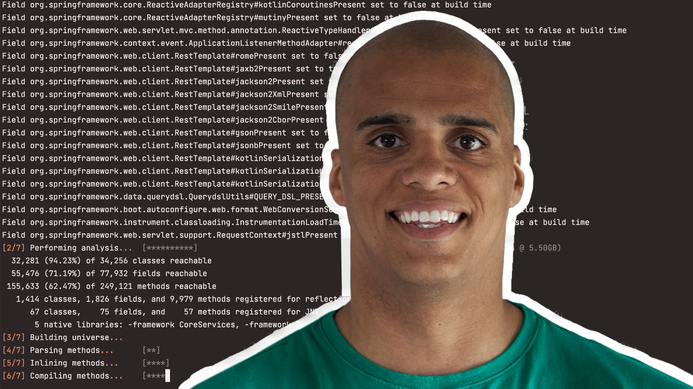

### Deliberately practicing to build, run, and manage, better software, faster.

- Every rep counts.
- Understand.  Be Understood.
- Latency is the new downtime.
- Continuously learning.

## Currently Working On

- Deploying ARM64 native images to edge devices with [Spring](https://spring.io)
- [Cloud Native Builpacks](https://dashaun.com/series/java-native-builder-multiarch/) for ARM64
- [Spring Boot 3 native with Spring Cloud](https://dashaun.com/series/spring-boot-3-native/)

  

[https://dashaun.com/](https://dashaun.com)
